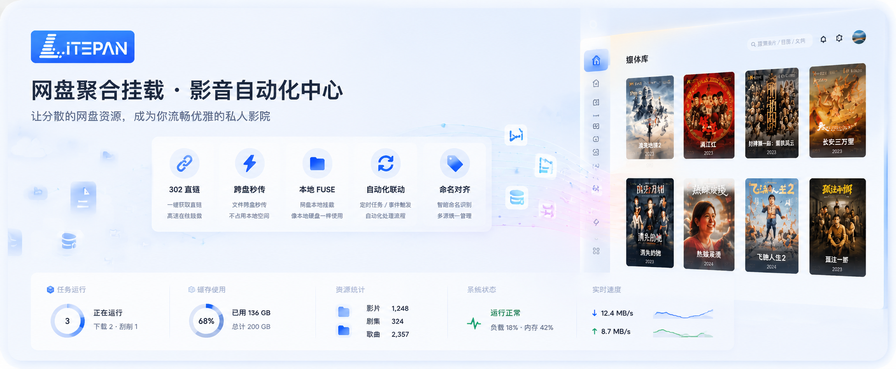

<a name="readme-top"></a>

<div align="center">




<a href="https://www.litepan.top"></a>
&nbsp;
<a href="https://space.bilibili.com/1501989416"></a>
&nbsp;
<a href="https://hub.docker.com/r/ponphil/litepan"></a>


[![docker-pulls][docker-pulls-shield]][docker-url]
[![version][version-shield]][docker-url]
[![license][license-shield]][license-url]

</div>

<br>

> [!IMPORTANT]
> **当前项目正在全面重构。**  
> 全新 **Go 版 LitePan** 即将取代本仓库，性能与架构都会焕然一新，**敬请期待**。  
> Python 旧版已归档至 [LitePan-old](https://github.com/Ponphil/LitePan-old)。

使用说明与进阶配置，请查看 **[官网文档](https://www.litepan.top)**（文档站点持续更新中）。

<br>

## ▎ 多网盘聚合

统一接入 115 / 123 / 百度 / 夸克 / 光鸭 / 天翼 / 移动 / OneDrive / WebDAV / 本地盘。  
浏览、上传、下载、预览与跨盘操作，一套界面完成。

<!--  -->

<br>

## ▎ STRM 影音库

按任务生成 `.strm`，对接 Emby / Jellyfin 等快速入库。  
支持增量同步、刮削海报墙与播放鉴权。

<!--  -->

<br>

## ▎ 智能目录整理

TMDB 识别、重命名与归档预览，先看计划再执行。  
把杂乱资源整理成标准电影 / 剧集结构。

<!--  -->

<br>

## ▎ 挂载与直链播放

WebDAV / FUSE 挂成「本地盘」；播放走 302 或代理直链，减轻 NAS 带宽压力。

<!--  -->

<br>

## ▎ 跨盘 · 离线 · 自动化

网盘间优先秒传，支持离线下载。  
规则联动整理、STRM 与通知，转存后自动入库。

<!--  -->

<br>

---

## ▎ 快速开始

```bash
docker run -d \
  --name litepan \
  --restart unless-stopped \
  -e TZ=Asia/Shanghai \
  -p 5212:5212 \
  -v ./data:/app/data \
  -v ./mounts:/app/mounts:shared \
  --device /dev/fuse \
  --privileged \
  ponphil/litepan:latest
```

```bash
docker compose up -d
```

打开 `http://你的IP:5212`，按提示设置管理员密码。  
需要 FUSE 时请确保宿主机具备 `/dev/fuse` 权限。

<br>

---

## ▎ 反馈

交流：[B 站主页](https://space.bilibili.com/1501989416)　·　暂不接受公开 PR

<br>

---

### ▎ 支持 LitePan

如果这个项目对你有帮助，欢迎点右上角 **Star**，也欢迎自愿赞赏。


<br clear="all">

<br>

---

## ▎ 许可

[PolyForm Noncommercial 1.0.0](./LICENSE) — 个人学习与非商业使用，**禁止商用**。  
第三方依赖见 [THIRD_PARTY_NOTICES.md](./THIRD_PARTY_NOTICES.md)。请遵守各网盘服务条款与当地法规。

[docker-pulls-shield]: https://img.shields.io/docker/pulls/ponphil/litepan?logo=docker&logoColor=white&style=flat-square
[version-shield]: https://img.shields.io/badge/Version-v0.4.0--beta-6C63FF?style=flat-square
[license-shield]: https://img.shields.io/badge/License-PolyForm%20NC-red?style=flat-square
[docker-url]: https://hub.docker.com/r/ponphil/litepan
[license-url]: ./LICENSE
